## Data Analysis practise
Libraries used: Pandas, Numpy, Matplotlib and Seaborn.
### Iris dataset
#### Scatter Plot: 
Visualizes the relationship between the index and petal length.

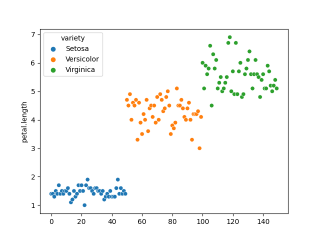
#### Strip Plot: 
Displays the distribution of petal length for each variety of flower.

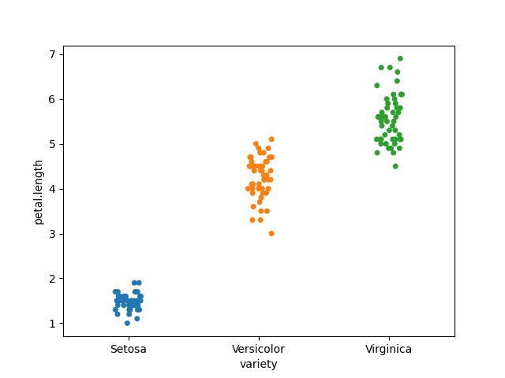
#### Distribution Plot: 
Shows the distribution of petal length using a kernel density estimation.

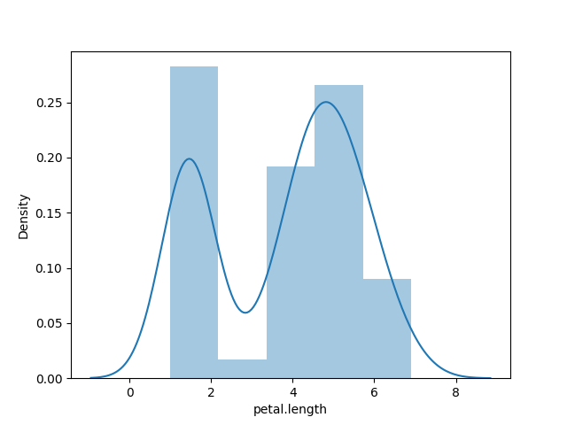
#### Histogram Plot: 
Illustrates the frequency distribution of petal length using bins.

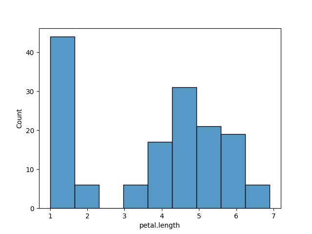
#### Box Plot: 
Represents the distribution and statistical summary of petal length.

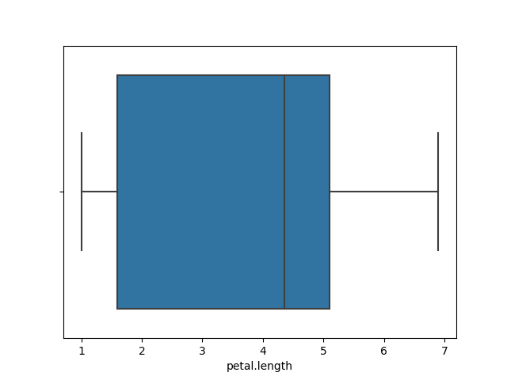
#### Count Plot: 
Counts the occurrences of each variety of flower.

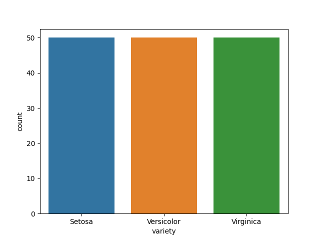
#### Pie Chart: 
Displays the proportion of each flower variety using a pie chart.

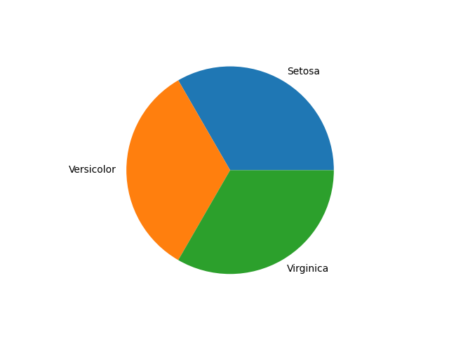

### Titanic dataset
#### Survival Ratio by Passenger Class: 
This bar plot shows the number of survivors based on passenger class. It provides insights into the survival rates of passengers in each class.

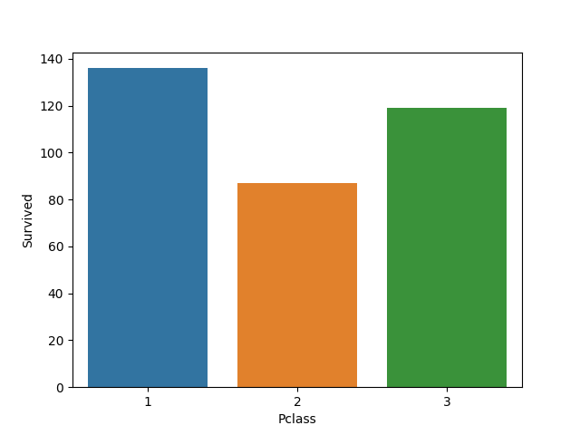

#### Age Distribution of Survivors
This box plot compares the age distribution between survivors and non-survivors. It helps in understanding the age demographics of the survivors.

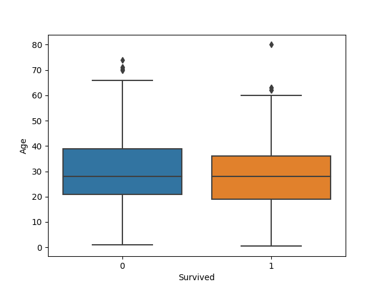

#### Age Distribution  by Sex
This bar plot displays the age distribution for males and females. It provides a visual representation of the age demographics for each gender.

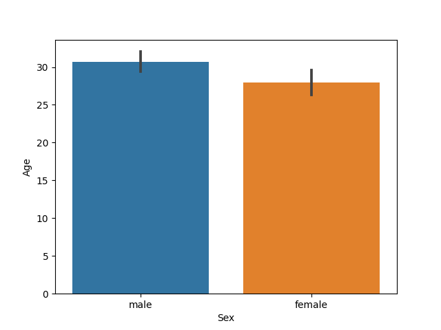

### Working with timestamps and dates
#### Stock Prices 2022
The plot provides a visual representation of how the stock price of the company changed over the course of the year.

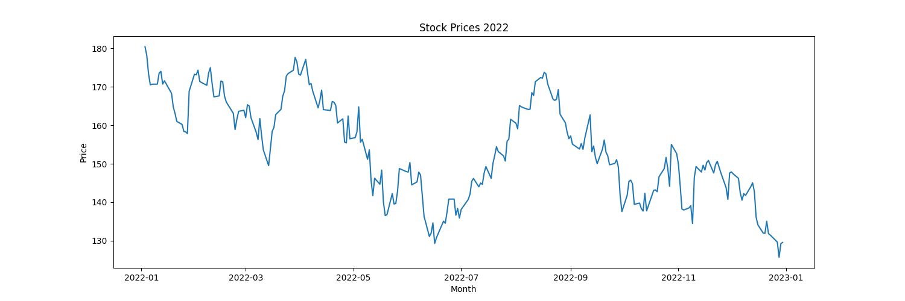
